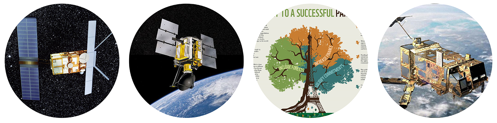

                                               %%%%%% Project Radar_Rainforest %%%%%%  
Until 2021. 02, there has been no well-calibrated C-band microwave (either active or passive) data set which measures forest structure/moisture and covers a long time span.   

There have been passive microwave VOD (Vegetation Optical Depth) data (C-band included) from AMSR-E (2002-2011) and AMSR2 (since 2012), but the two didn't overlap temporally. Hence, merging them with a full calibration has not been possible (Du et al. 2017. Earth Syst. Sci. Data 9, 791–808; Jackson et al. https://doi.org/10.5067/IKQ0G7ODMLC7; Moesinger et al. 2020. Earth Syst. Sci. Data 12, 177–196).   

The aim of Project Radar_Rainforest is to fill this gap, by providing a well calibrated, long-term (since 1992) C-band radar data set for global vegetated areas, especially for tropical rainforests.

This site provides the Matlab scripts for generating a harmonized long-term (since 1992) C-band radar data set for global tropical rainforests.  
Mat files related to the scripts are available at: https://filesender.renater.fr/?s=download&token=c0cb8523-76ab-4190-96f3-8cc260c2a67b
